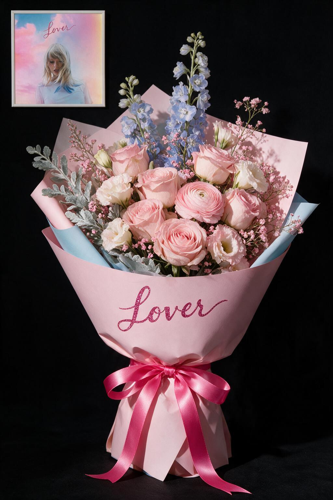
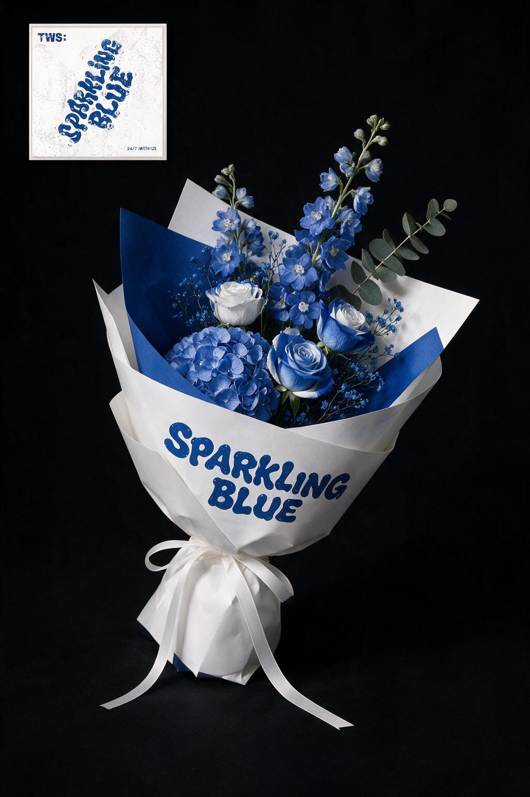
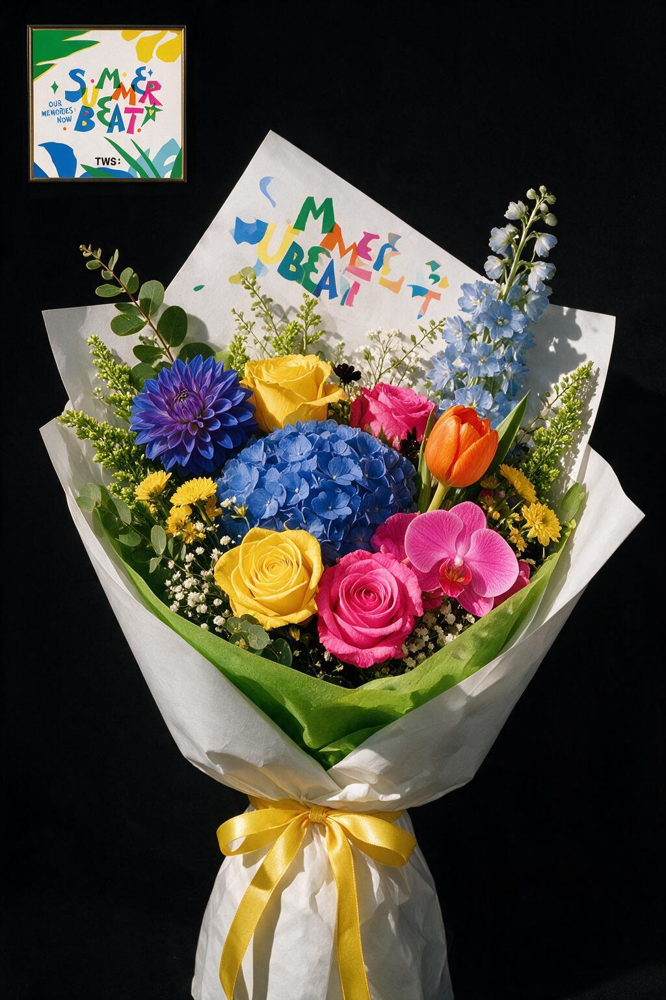

# 专辑花束（Album Bouquet）Skill

把一张专辑封面「翻译」成一束真实的高级花束，让配色与创作理念都呼应对应专辑。

## 这是什么

一个 Codex Skill，给定一张专辑封面（或艺人 / 专辑 / 歌名），自动完成四步，输出一束**配色与专辑一致、理念与专辑共鸣**的真实花束设计 + AI 生成成品效果图。

## 四步工作流

| 步骤 | 内容 |
|---|---|
| 0. 检索创作理念 | 用 web 搜索获取专辑的概念 / 作者意图 / 叙事，提炼可视觉化的理念关键词 |
| 1. 提取配色与版式 | 提炼主色 / 辅助色 / 点睛色 + 可复刻的文字、色块、质感 |
| 2. 设计花束方案 | 花材清单（真实花材）+ 包装方案 + 理念如何落到花材隐喻 |
| 3. 生成成品图 | 用 Codex 内置 `image_gen` 图生图，左/右上角附原专辑封面缩略图 |

## 成品案例

| Taylor Swift · Lover | TWS · Sparkling Blue | TWS · Summer Beat! |
|:---:|:---:|:---:|
|  |  |  |
| 粉色主调、浅蓝线条花与封面柔雾感呼应 | 蓝白同色系花材与几何包装呼应封面 | 多彩焦点花与白绿包装复刻夏日活力 |

## 运行方式

- 只使用 Codex 内置图像生成工具，不需要配置 `OPENAI_API_KEY`。
- 本地封面先通过 `view_image` 载入，再作为参考图逐张生成。
- 当前会话未提供内置 `image_gen` 时停止并明确提示，不自动切换 CLI、API 或第三方服务。

## 核心规则

- **花朵必须真实**：只选现实中存在的花/叶/草，不虚构
- **克制花材**：每次 3–5 种主花/配花 + 1–2 种叶材，疏密有致、可实际制作
- **喷漆/染色改色**：颜色对不上封面时，优先喷漆/染色统一色（如白玫瑰喷克莱因蓝），而非堆花色
- **配色一致硬性**：花束主色 = 封面主色，点睛色 = 封面跳色
- **包装材料不限制**：纸 / 纱 / 缎带 / 网纱 / 铝箔 / 背板 / 贴纸任意
- **包材可复刻专辑文字**：包装纸 / 背板印上专辑标题与艺人名，用封面对应字体的颜色

## 高级感规范（成品图）

1. 纯黑背景（哑光、无反光、无纹理）
2. 花束正放、居中、放大，占画面大部分
3. 封面缩略图固定左上角
4. 硬侧光做明暗层次
5. 重结构轻饱满（拒绝圆滚滚花球）
6. 尖角几何包装（硬挺挺括，不用软塌褶皱）
7. 色调克制（2–3 色 + 跨元素呼应，零杂色）

## 触发方式

说类似「帮我做一张 XXX 专辑的花束」「把这张封面做成花束」，或直接发一张专辑封面图。

触发词：专辑花束、专辑封面花束、应援花束、album bouquet 等。

## 使用场景

歌迷应援、花艺定制、创意礼物、专辑周边概念设计。

## 文件结构

```
album-flower/
├── SKILL.md                        # 主流程（四步工作流）
├── assets/
│   └── examples/                   # GitHub 可预览的成品案例
└── references/
    ├── flower-palette.md           # 真实花材库 + 颜色映射 + 喷漆染色手法
    ├── examples.md                 # 3 个成品案例 + 6 个设计拆解
    └── premium-style.md            # 高级感规范详解 + i2i prompt 模板
```
